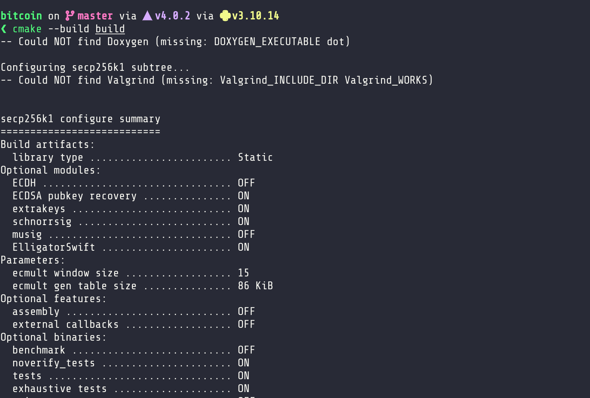
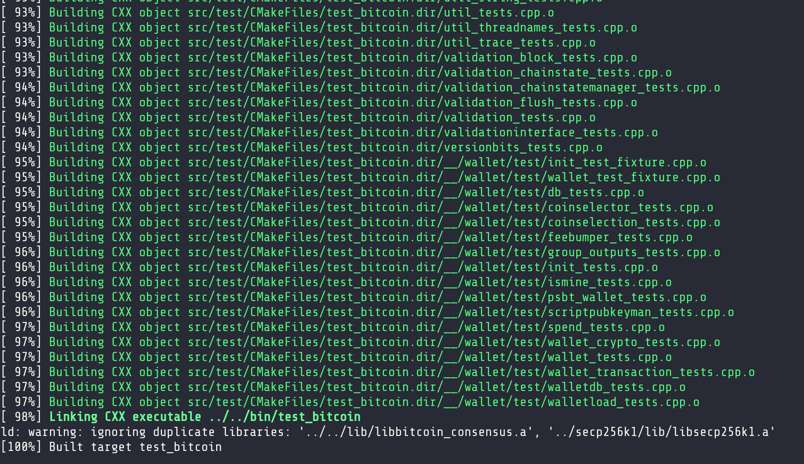
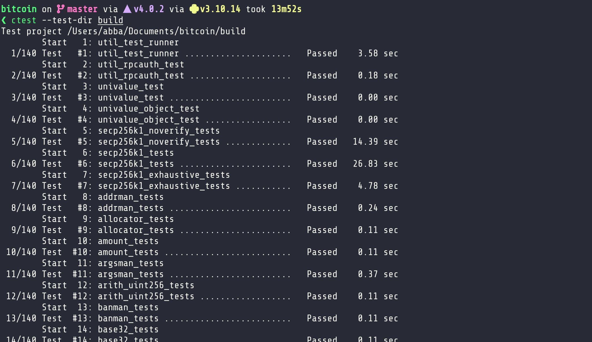
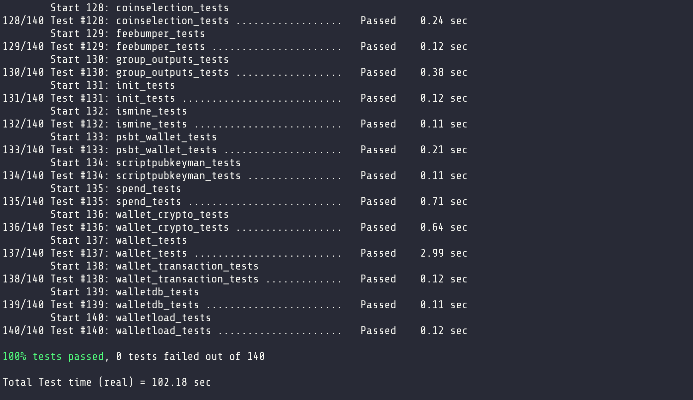
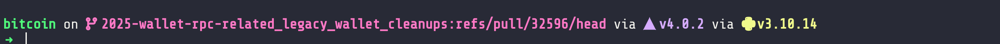
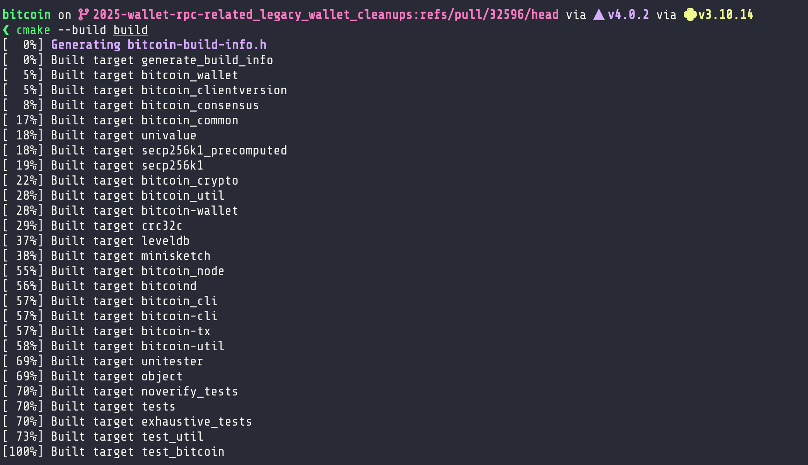
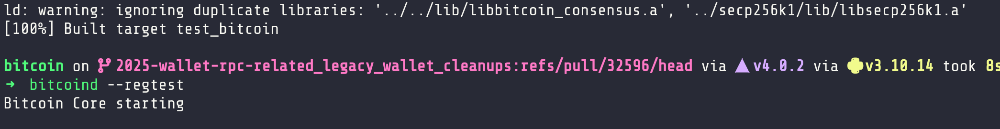
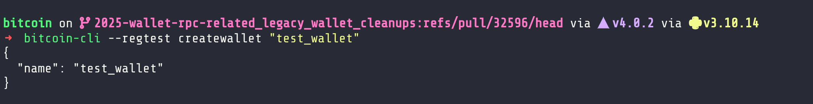

# Week 2

## Tasks

### Read the Bitcoin white paper and write short notes on (P2P networking, mempool, consensus, wallet). Extra tips:  <https://bitcoincore.academy/architecture.html>

So after reading through the white paper here's brief breakdown on each component itemized into bullet points:

**P2P Networking**

- Bitcoin uses a decentralized, peer-to-peer (P2P) network model.
- Nodes communicate directly without needing a central server.
- Each node maintains a copy of the entire blockchain.
- New transactions and blocks propagate via a gossip protocol.
- Helps prevent single points of failure and ensures redundancy.
- Peers validate and relay transactions and blocks they receive.

**Mempool**

- The mempool (memory pool) is a node-local list of unconfirmed transactions.
- When a user broadcasts a transaction, it enters the mempool before being mined.
- Miners select transactions from the mempool based on fee rates.
- Each node independently manages its mempool; it’s not globally synchronized.
- Transactions can be evicted due to mempool size limits or conflicts.

**Consensus**

- Consensus ensures all nodes agree on the state of the blockchain.
- Achieved via Proof-of-Work (PoW): miners compete to solve a hash puzzle.
- The longest valid chain (with the most accumulated work) is accepted.
- Forks may occur temporarily but resolve when one chain becomes longer.
- Double-spending is prevented because nodes accept only one valid chain.

**Wallet**

- A Bitcoin wallet is a tool for managing private keys.
- Does not store coins, but controls access to them via keys.
- Wallets can be:
- Full-node wallets (e.g. Bitcoin Core)
- SPV/lightweight wallets (use Merkle proofs)
- Hardware or mobile wallets
- Supports creating and signing transactions.
- Addresses are derived from public keys (often using Base58Check encoding).

### Select a BIP from the bips repository and indicate in the repository where it has been implemented [link](https://github.com/bitcoin/bitcoin/blob/master/doc/bips.md)

#### [BIP 32](https://github.com/bitcoin/bips/blob/master/bip-0032.mediawiki)

BIP 32 (Bitcoin Improvement Proposal 32) introduces Hierarchical Deterministic (HD) Wallets. It allows wallets to generate a tree of key pairs from a single seed and was introduced in [Bitcoin Core v0.13.0](https://github.com/bitcoin/bitcoin/blob/master/doc/release-notes/release-notes-0.13.0.md),implemented via [PR #8035](https://github.com/bitcoin/bitcoin/pull/8035)

**Key Features**

- Single Seed Backup
- All addresses and keys are derived from a single 128-512 bit seed.
- Hierarchical Structure
- Keys are organized in a tree, with parent/child relationships.
- Public Key Derivation
- Enables creation of child public keys from parent public keys without requiring private keys (useful for watch-only wallets).
- Hardened Derivation
- Provides extra security by preventing public key compromise from leading to parent key exposure.

**Code Implementation Highlight**

- Key Derivation Logic: Handled in wallet code (e.g. [wallet/wallet.cpp](https://github.com/bitcoin/bitcoin/blob/master/src/wallet/wallet.cpp))
- RPC Support: Functions like getnewaddress, dumpwallet work with HD wallets

### Review the functional and unit tests in Bitcoin core and run bitcoin core with all unit tests

Here are a few things i picked out from the bitcoin core testing workflow based on the official documentation:

#### Unit Tests

- Location: bitcoin/src/test
- Documentation: [README.md](https://github.com/bitcoin/bitcoin/blob/master/src/test/README.md)

**Purpose:**

- Test individual components of the Bitcoin Core codebase (e.g. block validation, script evaluation, utility functions).
- Fast to run and do not require a Bitcoin node.

**Test Framework:**

- Based on the Boost Test Framework.

**How to Run All Tests:**

```sh
# From the root of the repo (after building)
ctest --test-dir build
```

#### Functional Tests

- Location: bitcoin/test/functional
- Documentation: [README.md](https://github.com/bitcoin/bitcoin/blob/master/test/functional/README.md)

**Purpose:**

- Test full node behavior by simulating real-world usage.
- Covers P2P communication, mempool, mining, wallet, RPC commands, etc.

**Test Framework:**

- Python based test framework.
- Uses test_framework modules in test/functional/test_framework/.

**How to Run All Tests:**

```sh
# Requires Python 3 installed
./build/test/functional/test_runner.py
```

#### Building bitcoin core and running all unit tests

- Firstly, I built bitcoin-core from source following the [OSX](https://github.com/bitcoin/bitcoin/blob/master/doc/build-osx.md) guide

  ```sh
  cmake --build build
  ```

  - **Screenshots**

  - 
  - 

- Finally, i then ran all unit tests as specified in the [Unit test docs](https://github.com/bitcoin/bitcoin/blob/master/src/test/README.md)

  ```sh
  ctest --test-dir build
  ```

  - **Screenshots**

  - 
  - 

### Review at least 1 merged pull request from either of these sections or others that interest you

- P2P networking,
- Mempool,
- Consensus,
- Wallet
summarize the problem and solution and update your submission link

---

- PR: [wallet, rpc, doc: various legacy wallet removal cleanups in RPCs #32596](https://github.com/bitcoin/bitcoin/pull/32596)
- Author: [theStack](https://github.com/theStack)

#### Breakdown

The PR in summary does the following:

- [X] Removes outdated "keypoololdest" from getwalletinfo RPC and related code.
- [X] Updates wallet RPC documentation to drop obsolete "descriptor wallet" mentions for rescans.
- [X] Cleans up createwallet RPC examples by removing no-longer-needed "descriptors" parameter.
- [X] Finalizes codebase for descriptor-only wallet model by removing legacy wallet remnants.

#### How i tested the PR

- checkout out to [PR #32596](https://github.com/bitcoin/bitcoin/pull/32596)

  ```sh
  gh pr checkout 32596
  ```

  - **Screenshots**

  - 

- re-compile bitcoin core
  
  ```sh
  cmake --build build
  ```

  - **Screenshots**

  - 

- start bitcoind or bitcoin-qt with a new descriptor wallet.

  ```sh
  bitcoind --regtest
  ```

  - **Screenshots**

  - 

- create wallet called "test_wallet"

  ```sh
  bitcoin-cli --regtest createwallet "test_wallet"
  ```

  - [X] Confirm the `descriptors` option is not needed or present.

  - **Screenshots**

  - 

- Fetch wallet info:

  ```sh
  bitcoin-cli --regtest rpcwallet=test_wallet getwalletinfo
  ```

  - [X] Confirm "keypoololdest" is no longer in the output.

  - **Screenshots**

  - 

#### In Conclusion

ACK [e5cbea4](https://github.com/bitcoin/bitcoin/commit/e5cbea416b2f63e5d99819052f3e69a6383336d6), tested locally

### Attempt to recreate at least 1 open issue from either of these sections or others that interest you

- P2P networking,
- Mempool,
- Consensus,
- Wallet
Summarize the problem and solution and update your submission link.

(Optional):
Join in the discussion and make a meaningful contribution to the issue. Please do not spam or divert the conversation to something irrelevant.

---

- Issue:[combinerawtransaction confusing with distinct transactions #25980](https://github.com/bitcoin/bitcoin/issues/25980)
- status: Open
- PR: [PR #31298](https://github.com/bitcoin/bitcoin/pull/31298)
- Author: [luke-jr](https://github.com/luke-jr)

#### Issue Summary

The `combinerawtransaction` RPC method is designed to merge multiple raw transactions into a single transaction. However, if the transactions are unrelated (i.e., they do not share inputs or are not meant to be combined), the method should ideally either:

- Throw an error indicating that the transactions cannot be combined, or
- Combine them in a meaningful way, if possible.

In this case, the method silently ignored all but the first transaction, which is not ideal behavior.

#### Conclusion

The pull request provided above updates the `combinerawtransaction`` RPC to check if transactions are mergeable and throws a descriptive error if not, potentially fixing issue if merged. It modifies these two files: [rawtransaction.cpp](https://github.com/bitcoin/bitcoin/pull/31298/files#diff-a58e7bb9d9a8a0287c0b7281d99da4e79b6f8c2a5780c24c6d76c14212c48640) and [rpc_rawtransaction.py](https://github.com/bitcoin/bitcoin/pull/31298/files#diff-631471fc7424bdff96f8470074c7d4bc4d219fdb43a3ebdd36af933c1276637a), implementing the fix

### Share the new things you learned from this week

- I learnt about how bitcoin's function test framework is very robust and also the choice of using python as the language is really interesting. I'm assuming that this choice was made based on the fact that python is easy to pick up and use by devs
