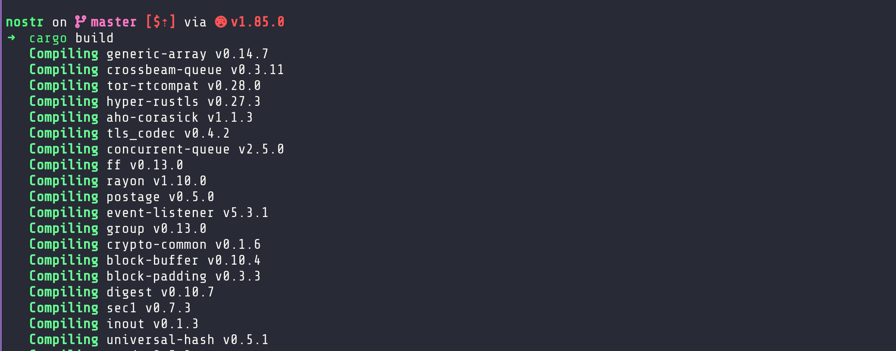

# Week 3

## 1. Project Selection

- **Project Chosen:** [rust-nostr](https://github.com/rust-nostr/nostr)

## 2. Initial Project Exploration

- **Summary of Project Goal:**
  `rust-nostr` is a Rust implementation of the Nostr protocol. It provides a modular and extensible toolkit for building Nostr clients, relays, and other tooling in the Rust programming language. The project offers various libraries (crates) to interact with Nostr's decentralized event and relay network, making it easier for developers to create secure, efficient, and standards-compliant applications.

- **Known Use Cases / Dependencies:**

  - **Nostr SDK Flutter**  

    - Dart bindings for `rust-nostr`  
    - Enables Nostr protocol support in Flutter apps  
    - [Repo](https://github.com/rust-nostr/nostr-sdk-flutter)

  - **Nostr SDK React Native**  

    - JavaScript/TypeScript bindings for `rust-nostr`  
    - Facilitates Nostr integration in React Native applications  
    - [Repo](https://github.com/rust-nostr/nostr-sdk-react-native)

  - **Nostr SDK JS**  

    - JavaScript/TypeScript bindings for `rust-nostr`  
    - Allows Nostr protocol usage in various JS environments  
    - [Repo](https://github.com/rust-nostr/nostr-sdk-js)

  - **Nostr Rest API**  

    - RESTful API bridge for interacting with Nostr relays  
    - Built upon `rust-nostr`  
    - [Repo](https://github.com/rust-nostr/nostr-rest)

  - **Rust Nostr Server**

    - A Nostr relay server implemented in Rust  
    - Based on the `rust-nostr` library  
    - [Repo](https://github.com/kasugamirai/rust-nostr-server)

  - **Rnostr**

    - High-performance, scalable Nostr relay  
    - Inspired by `rust-nostr`  
    - [Repo](https://github.com/rnostr/rnostr)

## 3. Local Setup & Testing

- **Setup Steps:**

  ```bash
  git clone https://github.com/rust-nostr/nostr.git
  cd nostr
  cargo build
  ```
  
  

- **Dependencies Installed:**

  - `Rust` (via rustup)
  - `cargo` (installed with Rust)
  - No additional system dependencies listed

- **Running Tests:**

  ```bash
  cargo test
  ```

  

- **Test Results:**

  - All tests passed.

- **CI Pipeline:**
  The GitHub Actions CI pipeline defined in `.github/workflows/ci.yml` uses custom scripts found in `contrib/scripts` to enforce standards and verify crate integrity these scripts are:

  - `check-fmt.sh`

    - Runs `cargo fmt --check`
    - Ensures all Rust code is properly formatted
    - Used in the `Format` CI job

  - `check-crates.sh`

    - Validates each crate using `cargo check` and related tooling
    - Accepts two arguments:

      - First: optional target (e.g., `msrv` for Minimum Supported Rust Version)
      - Second: mode (`ci` in CI context)
    - Ensures each crate compiles correctly

  - `check-docs.sh`
    - Runs `cargo doc`
    - Ensures documentation builds without errors
    - Used in the `Check docs` CI job

  The CI pipeline ensures the project:

  - Builds correctly
  - Crate compilations are validated
  - Passes all tests
  - Works across different platforms and Rust versions
  - Follows a standard code style/format
  - Documentation is up-to-date and correct

## 4. Understanding Contribution & Community

- **Core Maintainers:**

 > [!Note]
 > For now i am only able to confirm that [yukibtc](https://github.com/yukibtc) has write access to the repo as he has been the developer merging PRs. also the [Maintainers page](https://rust-nostr.org/maintainers.html) on the official docs mentions only one maintainer, yukibtc.

- **Primary Communication Channels:**

  - GitHub Discussions (Issues and PR comments)
  - Nostr

- **Contribution Guidelines Summary:**

  - Fork the repo, create a topic branch, and submit patches via PR.
  - Avoid breaking APIs; deprecate with `#[deprecated]` and plan removal in the next minor release.
  - Use `just precommit` or `just check` before committing; CI enforces this.
  - Follow the [code style](https://github.com/rust-nostr/nostr/blob/master/CODE_STYLE.md) before pushing any changes.

- **Commit Message Style:**

  As explained in the [CONTRIBUTING.md doc](https://github.com/rust-nostr/nostr/blob/master/CONTRIBUTING.md) commits must follow the format `<context>: <short description>` with a detailed explanation and optional issue/PR reference, using predefined contexts like nostr, sdk, ffi, ci, test, doc, etc., to indicate the scope of the change.

  - Example

    ```
    nostr: add NIP32 support

    Added kinds, tags and EventBuilder constructors to support NIP32.

    Closes https://<domain>.com/rust-nostr/nostr/issue/1234
    ```

## 5. Code & Issue Review Practice

### Merged PRs

- **PR #899**: [nostr: rework `NostrParser`](https://github.com/rust-nostr/nostr/pull/899)  
  - **Problem**: `NostrParser` used regex and required a `parser` feature, resulting in performance and binary size overhead.
  - **Solution**: Removed regex and the `parser` feature, replacing them with a built-in pattern finder, doubling parsing performance and reducing binary size and feature complexity.
- **PR #895**: [nostr: remove Market::Mention (NIP-10)](https://github.com/rust-nostr/nostr/pull/895)  
  - **Problem**: The `Marker::Mention` variant in NIP-10 was outdated based on recent changes to the protocol spec.  
  - **Solution**: Removed the `Marker::Mention` variant to align with the latest [NIP-10 spec update](https://github.com/nostr-protocol/nips/commit/0023ca81)
- **PR #894**: [nostr: remove get_relays command from NIP-46](https://github.com/rust-nostr/nostr/pull/894)  
  - **Problem**: The `get_relays` command was deprecated in NIP-46, which defines a remote signer protocol for Nostr.  
  - **Solution**: Removed the command to align with the latest spec update and reduce dead code.

### Open PRs

- **PR #866**: [feat(group): add methods add_members, remove_members, leave_group](https://github.com/rust-nostr/nostr/pull/866)  
  - **Problem**: The rust-nostr crate lacks the functionality for managing group membership, limiting its ability to handle dynamic group interactions.  
  - **Solution**: Introduced methods to add, remove group members and to also leave a group, and updated `process_message_for_group` to handle commit messages, enhancing support for group-based Nostr events.

- **PR #902**: [build(deps): bump rustyline from 15.0.0 to 16.0.0](https://github.com/rust-nostr/nostr/pull/902)  
  - **Problem**: Keeping dependencies up-to-date to benefit from bug fixes and improvements.  
  - **Solution**: Updated the `rustyline` crate—a readline-like library for handling command-line input editing. Checked out the PR and confirmed that the build completes successfully.

> [!Note]
> remaining PRs just like the one above are either drafts or are also dependabots proposed updates to dependencies, which are not critical to review at this stage as they don't break builds.

### Open Issues

- **Issue #762**: [Add event kind 15 support](https://github.com/rust-nostr/nostr/issues/762)
  - **Problem**: Event kind 15, which represents file message type for sending files message events on Nostr, is not yet implemented.  
  - **Proposed Solution**: Add support for parsing and handling kind 15 events to enable file message exchange between clients. I'm currently working on this issue and have based my solution on the [NIP-17 spec](https://github.com/nostr-protocol/nips/blob/6e7a618/17.md#file-message-kind)

- **Issue #829**: [NIP-52 Calendar Events support](https://github.com/rust-nostr/nostr/issues/829)  
  - **Problem**: Event kind 52 (calendar events) is currently not supported, limiting use cases like event organization and community coordination.  
  - **Proposed Solution**: Implement NIP-52 support to enable calendar/event metadata, aiding adoption in clients like [Flockstr](https://github.com/zmeyer44/flockstr) and [Comingle](https://github.com/comingle-co/comingle-ios) that already support the spec.
  
- **Issue #681**: [Offline Caching](https://github.com/rust-nostr/nostr/issues/681)  
  - **Problem**: There's no built-in way to queue created events offline and resend them per-relay once reconnected, limiting offline functionality.  
  - **Proposed Solution**: Add SDK support to store and later sync events per relay (possibly via serialization or Primal Server integration), enabling offline workflows like reading/posting in utility apps (e.g., task managers like mostr).
