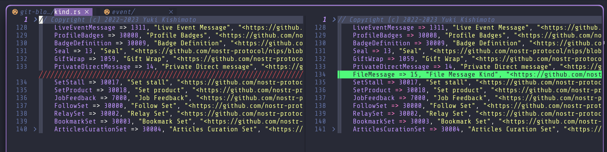

# week 4

## Step 1: Verify Your Development Environment

### Confirm setup status (e.g., “Rebuilt Bitcoin Core on macOS, all tests passed”)

- rebased on upstream master

  ```sh
  git pull --rebase upstream master
  ```

- Rebuilt crates with no errors

  ```sh
  cargo build
  ```

[](https://asciinema.org/a/gr5ySuycS271twsPQCpEWZlIB)

- ran tests with no errors

  ```sh
  cargo test
  ```

[](https://asciinema.org/a/ncCtsKymjttt5D6HtOTyVypx6)

### Note any new issues fixed (e.g., “Updated libboost to resolve build error”)

- No new issues fixed, but rebased on upstream master to ensure compatibility with the latest changes.

## Step 2: Select a “Good First Issue”

### Link to your issue

- issue: [issue #762](https://github.com/rust-nostr/nostr/issues/762)

### Explain why it’s a good fit (e.g., “It’s a Python test, and I’ve written pytest suites before”)

I'm interested in working on this issue because it involves implementing a feature that enhances the functionality of the rust nostr library. The issue is well-defined, and I have a bit of experience with Rust programming, which will help me contribute effectively. At the time I asked to be assigned the issue, I had not worked with the rust-nostr library before, so this was a great opportunity to learn and contribute to the project.

furthermore, something i did to boost my confidence a little was to work on [PR #6](https://github.com/rust-nostr/book/pull/6) to at least get a basic feel of the library and how it works. This PR was a simple one that added a new section to the book, but it helped me understand the structure of the project and how to contribute effectively.

## Step 3: Implement Your Contribution

### Share a screenshot of your code changes (git diff or IDE diff view)

The screenshot and asciicast below show some changes I've made to two files out of multiple files in an effort to implement event kind 15 described in [issue #762](https://github.com/rust-nostr/nostr/issues/762). So i'm basically:

- Specifying an event kind variant that maps to a numeric identifier
- Implementing constructor functions for generating standardized nostr event tags that I would later use



- file:`crates/nostr/src/event/kind.rs`

[](https://asciinema.org/a/hXsLeqsiWWwiEtvx49THjfCEN)

- file:`cates/nostr/src/event/tag/mod.rs`

### Describe challenges and solutions (e.g., “Fixed a test failure by mocking a transaction”)

## Step 4: Write a Clear Commit Message

### Paste your commit message

My Approach is to break the feature implementation into smaller, manageable commits, each addressing a specific part of the feature. This makes it easier for reviewers to understand the changes and provides a clear history of the development process.

### Justify its adherence to project style (e.g., “Matches Bitcoin Core’s prefix + issue format”)

I can confirm that my commit message adheres to the project's [Commit style](https://github.com/rust-nostr/nostr/blob/master/CONTRIBUTING.md#commit-style). The commit message is clear, concise, and follows the format used in the project. It includes a brief description of the changes made and references the pr number for context since i have multiple commits in the same PR.

## Step 5: Submit Your Pull Request

### Link to your PR

- PR Draft: [PR #886](https://github.com/rust-nostr/nostr/pull/886)

### Share a screenshot of the PR page (description, CI status)

## Step 6: Collaborate with Maintainers

### Summarize feedback and responses (or planned responses if none yet)

No feedback yet as my PR is still a work in progress, but I plan to respond promptly once I receive it. I will address any comments or suggestions made by the maintainers and make the necessary changes to my code to ensure it meets the project's standards.
